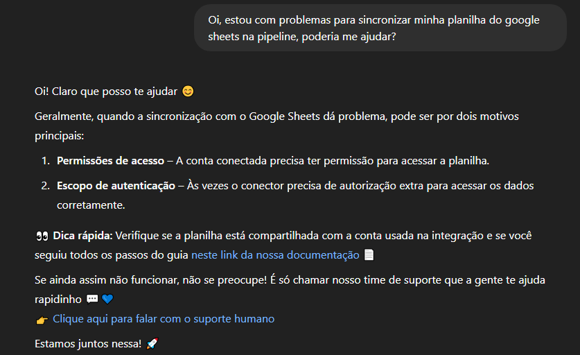
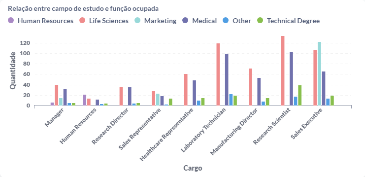
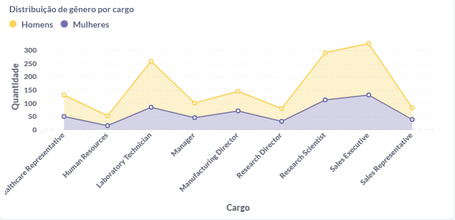
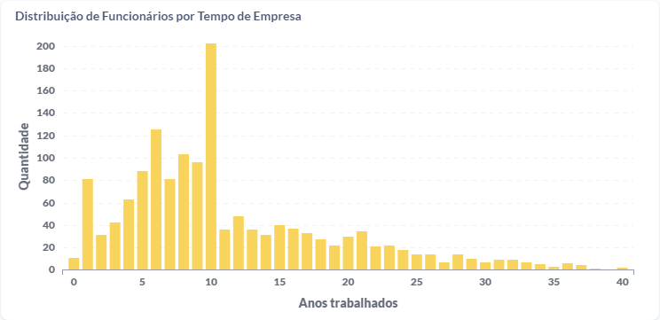
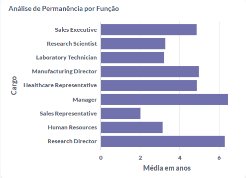
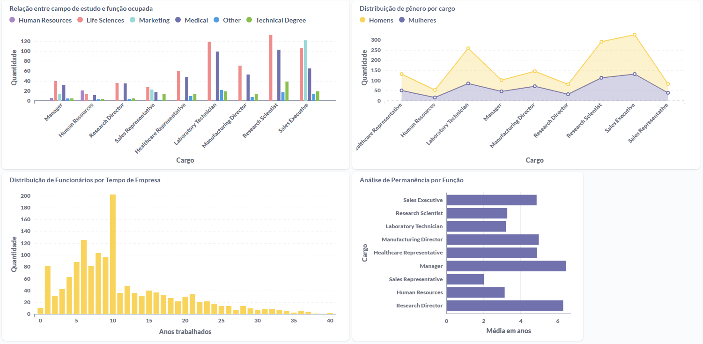

# Case interview - Analista de Suporte Dadosfera v1.1
## Links
Apresentação: [Youtube](https://www.youtube.com/watch?v=q2NX8lAByZU)

PDF: [PDF](CaseDadosferaPDF.pdf)


# Item Troubleshooting

Ao ler o erro informado nos logs da pipeline, é possível verificar que está ocorrendo um erro 403 na requisição que é feita para o google API. Podemos ver nas linhas a seguir que é gerado um token de acesso e então a plataforma faz o request via Google API para a planilha online, e a requisição é retornada com o erro de permissão negada.

```text
#token válido por 1 hora foi obtido
2025-04-10 16:30:14.402  INFO        core.meltano.utils               Authorized, token expires = 2025-04-10 17:30:12.620625

#Início do processo de descoberta dos dados da planilha
2025-04-10 16:30:14.403  INFO        core.meltano.utils               Starting discover

#URL da API do Google Sheets sendo acessada para obter os metadados da planilha
2025-04-10 16:30:14.403  INFO        core.meltano.utils               spreadsheet_metadata URL = https://sheets.googleapis.com/v4/spreadsheets/15embtJvuEVFgsmAWjdqNiRqvcZe79o_NJTRe2YffQ0c?includeGridData=false

#Chamada HTTP, a resposta foi um erro 403
2025-04-10 16:30:14.404  INFO        core.meltano.utils               METRIC: {"type": "timer", "metric": "http_request_duration", "value": 0.145982027053833, "tags": {"endpoint": "spreadsheet_metadata", "http_status_code": 403, "status": "succeeded"}}

#ACCESS_TOKEN_SCOPE_INSUFFICIENT indica que o token gerado é válido, porém não possui permissão para usar o método GetSpreadsheet
2025-04-10 16:30:14.404  CRITICAL    core.meltano.utils               HTTP-error-code: 403 {
    'code': 403,
    'message': 'Request had insufficient authentication scopes.',
    'status': 'PERMISSION_DENIED',
    'details': [
        {
            '@type': 'type.googleapis.com/google.rpc.ErrorInfo',
            'reason': 'ACCESS_TOKEN_SCOPE_INSUFFICIENT',
            'domain': 'googleapis.com',
            'metadata': {
                'service': 'sheets.googleapis.com',
                'method': 'google.apps.sheets.v4.SpreadsheetsService.GetSpreadsheet'
            }
        }
    ]
}: Unknown Error
```

Nesse caso não é possível determinar pelos logs se existe algum erro na planilha em si devido ao erro ocorrer antes da importação ser realizada, entretanto é visto um erro de permissão da conta recebida pelo Connection Manager para gerar o token em questão. Conforme informado pelos logs, essa conta foi criada em 2025-03-31, mesma data que a pipeline foi criada, portanto a maior probabilidade é a de que seja uma conta de serviço (compartilhada) que é utilizada para ter acesso à API e precisa ter suas permissões corrigidas.

A resposta final ao cliente seria apresentada desta forma:

>Boa tarde João, meu nome é Rafael, sou da equipe do suporte, tudo bem? 
>
>Estou entrando em contato referente ao chamado aberto XX sobre o erro de coleta na Dadosfera.
>
>Durante a análise foi verificado que o erro é gerado no momento em que a plataforma tenta acessar a planilha do google, ou seja, na primeira etapa de comunicação entre a pipeline e a planilha online. Para resolver isso, vou encaminhar essa questão para nosso time que cuida dessa parte do processo, para que eles verifiquem e adicionem a permissão que está faltando, assim resolvendo o erro para você poder importar as planilhas na pipeline. 
>
>Assim que a equipe me retornar eu te informo, tudo bem? 


# Item Processos Internos


## Transição para Nova Plataforma de Gerenciamento de Diretório com SSO

A incorporação de uma nova plataforma de gerenciamento de diretório em nuvem com SSO e recursos de ciclo de vida do usuário cria mais segurança, centralização e controle de acesso. Para garantir uma boa transição, é necessário seguir um plano estruturado com foco tanto técnico quanto na experiência do cliente.

---

### Etapas de Implementação

#### 1. **Planejamento e Diagnóstico**
- Mapeamento dos sistemas que serão impactados.
- Identificação dos fluxos de autenticação existentes.
- Avaliação da integração com a nova plataforma.

#### 2. **Comunicação com os Clientes**
- Envio de comunicado antecipado informando:
  - Objetivo da mudança.
  - Benefícios da nova plataforma.
  - Cronograma previsto.
- Materiais de apoio: documentação, vídeos tutoriais e perguntas frequentes.

#### 3. **Ambiente de Testes**
- Liberação antecipada da funcionalidade para um grupo de usuários selecionados.
- Coleta de feedback para ajustes.
- Simulação de diferentes casos.

#### 4. **Migração Gradual**
- Faseamento por grupo de usuários ou domínios.
- Monitoramento em tempo real de falhas de autenticação ou erros.
- Suporte dedicado no período da transição.

#### 5. **Suporte**
- Treinamento para equipes de suporte.
- Canais de atendimento com foco exclusivo na migração.

---

### Impacto no Caso Anterior

Essa transição pode impactar diretamente situações como a do caso anterior, onde houve erro de autenticação ao acessar o Google Sheets. As contas utilizadas para gerar o token de acesso na API podem precisar serem autorizadas novamente, ou até refeita caso não tenha sido migrada.


## Integração de Chatbot com IA na Dadosfera

Suponha que a Dadosfera disponha de uma ferramenta de Chatbot com Inteligência Artificial, que possa ser integrada à plataforma para melhorar a experiência de suporte dos usuários. Abaixo, explico como essa ferramenta poderia ser implementada e quais impactos positivos ela traria.

---

### Objetivo da Integração

O objetivo é acelerar o atendimento de chamados comuns, guiar o usuário de forma proativa, reduzir a sobrecarga da equipe de suporte e garantir uma experiência satisfatória ao usuário.

---

### Estratégia de Implementação

1. **Mapeamento de dúvidas frequentes:**
   - Levantar os temas mais comuns de suporte.
   - Indexar conteúdos como a [documentação oficial](https://docs.dadosfera.ai) e históricos de atendimentos para o treinamento.

2. **Treinamento da IA:**
   - Alimentar a IA com exemplos reais de atendimentos e documentos relevantes.
   - Validar respostas com o time de suporte antes de liberar para o público.

3. **Criação do fluxo de atendimento:**
   - Chatbot atua na triagem inicial.
   - Realizar o atendimento de acordo com o treinamento ou acionar o time de suporte se for necessário.

4. **Integração ao ambiente Dadosfera:**
   - Inclusão do botão de chat no ambiente de produção.
   - API para coleta de logs em tempo real para facilitar o atendimento da IA.

5. **Feedback:**
   - Após cada interação, o usuário poderá avaliar a resposta da IA.
   - A equipe de suporte utiliza esse feedback para aprimorar o modelo.

---

### Exemplo de atendimento da IA



---

### Fluxo Resumido do Atendimento com IA


# Item Consultas SQL


## Consulta 1 – Relação entre campo de estudo e função ocupada

>SELECT COUNT(*) AS "Quantidade", EDUCATIONFIELD AS "Área de formação", JOBROLE AS "Cargo" FROM TB__YCYBP3__CASE_TECNICO_EMPLOYEE_TB GROUP BY EDUCATIONFIELD, JOBROLE ORDER BY EDUCATIONFIELD;



## Consulta 2 – Distribuição de gênero por cargo

>SELECT COUNT (*) AS "Quantidade", DECODE(GENDER, 'Male', 'Homens', 'Female', 'Mulheres') AS "Gênero", JOBROLE AS "Cargo" FROM TB__YCYBP3__CASE_TECNICO_EMPLOYEE_TB GROUP BY GENDER, JOBROLE ORDER BY JOBROLE;



## Consulta 3 – Distribuição de Funcionários por Tempo de Empresa

>SELECT TOTALWORKINGYEARS AS "Anos trabalhados", COUNT(TOTALWORKINGYEARS) AS "Quantidade" FROM TB__YCYBP3__CASE_TECNICO_EMPLOYEE_TB group by TOTALWORKINGYEARS order by TOTALWORKINGYEARS;



## Consulta 4 – Análise de Permanência por Função

>SELECT AVG(YEARSINCURRENTROLE) AS "Média em anos", JOBROLE AS "Cargo" from TB__YCYBP3__CASE_TECNICO_EMPLOYEE_TB GROUP BY JOBROLE;



## Dashboard completo


